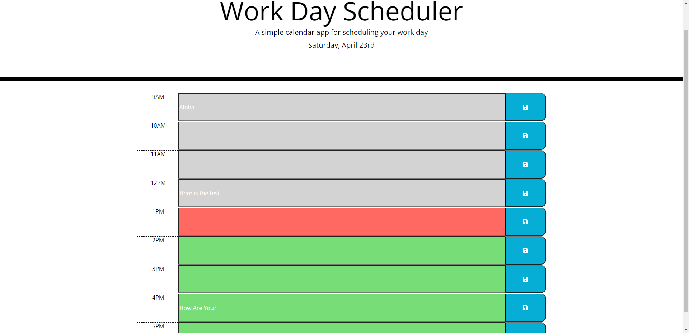

# UCSD_HW5_Work-Day-Scheduler
Create a simple calendar application that allows a user to save events for each hour of the day by modifying starter code. This app will run in the browser and feature dynamically updated HTML and CSS powered by jQuery.

## User Story

```
AS AN employee with a busy schedule
I WANT to add important events to a daily planner
SO THAT I can manage my time effectively
```

## Link to the Calendar Application.

* Click here to start using the calendar application: [Calendar!](https://hengyu89.github.io/UCSD_HW5_Work-Day-Scheduler/)

## What I've done

* When you go to the webpage, you'll see the current date (day of week, day and month) shows right below the title (it might take several seconds due to the moment js function.)

* You'll see the time zones separated by hour, and time zones cross from 9 am to 5 pm.

* Correspond to the current time, the time zone in the pase will show as Gray, the current time zone will show as Red, and the future will show as Green. Good for distinguish.

* Here you could write your plan in the block of time zones. And you need ti click the "save" icon on the right shown as blue. Once you click the "save" button, all text of your written plans would be saved. (For convenience, all blue buttons will work as same functionality, that saves your plans in all time zones. But make sure you save at least once.)

* Once you save your plans, whenever you refresh the webpage, the saved plans will always be shown there. (Not available for different devices.)

## Screenshot with one demo

